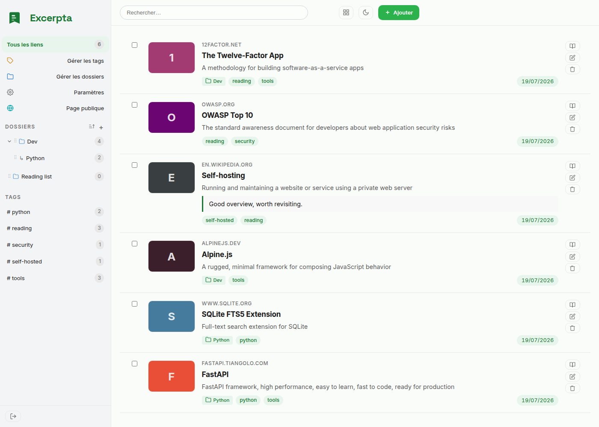
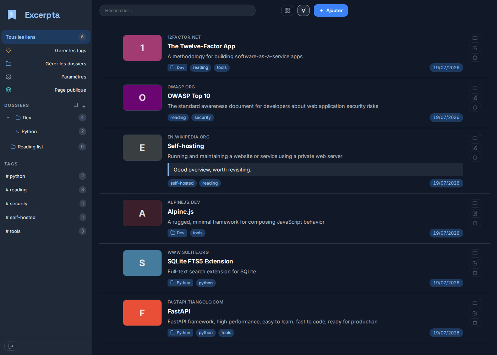

<p align="center">
  
</p>

# Excerpta

> **🤖 Vibe Coded with Claude**
> This project was built through an AI-assisted development session with [Claude](https://claude.ai) (Anthropic).
> It is shared as-is, without warranty of any kind. Test thoroughly before relying on it for anything critical.
>
> Remember: if you don't like projects coded with AI help don't use them ;-)

**Self-hosted link manager** - collect, annotate and find your links again from any device.

> collect • annotate • remember

---

## Screenshots

<p align="center">
  
  
</p>

---

## Features

### Link management
- **Automatic metadata**: title, description, og:image thumbnail and favicon extracted on save
- **Markdown notes** per link (full rendering)
- **Multiple tags** per link, with inline rename/delete from the sidebar (automatic merge if the target name already exists)
- **Hierarchical folders**: collapsible/expandable nested tree (state remembered), recursive subfolder filtering, inline rename from the sidebar and one-click alphabetical (A→Z) sort
- **Drag & drop**: move a link to another folder from the sidebar, reorder and reparent folders
- **Reader view**: clean, readable version of each article (Readability extraction + anti-XSS sanitization), refined typography, adjustable font size, light/dark theme, estimated reading time - extracted on demand then cached
- **Visibility**: each link can be public or private; a per-user public page (`/u/{slug}`) with an RSS feed (`/u/{slug}/feed.xml`)
- **Wayback Machine archiving**: automatic background archiving of every new link, per-link status visible (in progress / archived / failed), on-demand re-archiving and bulk archiving of existing links
- **Bulk actions** on a multi-selection: delete, move to folder, add tags

### Search and navigation
- **Real-time search** (search-as-you-type): results filtered as you type, no page reload
- **Full-text search** (SQLite FTS5) across titles, descriptions, notes, URLs and tags - accent-insensitive
- **Weighted bm25 relevance** (title > tags > description/note > URL) and term highlighting in titles
- Filter by folder, tag, or both combined; AJAX pagination, shareable URLs (back button supported)

### Import / Export
- **Bookmark import** in Netscape HTML format (Firefox, Chrome, Safari) - folders included
- **Export** to Netscape HTML format with groups
- **Broken link checker** (async, 10 checks in parallel) - dead links offer the cached reader copy and/or the Wayback archive
- **Metadata refresh** with real-time progress

### Integrations
- **FreshRSS sync**: automatic import of starred articles every N minutes (configurable)
- **Browser bookmarklet** for quick add from any page
- **Android app** (excerpta-android): built-in configuration QR code (`GET /settings/android-qr.png`)

### Interface
- **9 CSS themes**: light, dark, dracula, nord, nord-dark, catppuccin, gruvbox, solarized, rosepine - one-click light/dark toggle
- og:image thumbnails with server-side proxy (bypasses Firefox's CORP/ORB restrictions)
- Colorful visual placeholder for links without a thumbnail
- Responsive - works on mobile and desktop

### Authentication and security
- **OIDC/PKCE** (PocketID, Keycloak, Authentik, any compatible provider)
- CSRF protection, rate limiting by real IP (behind reverse proxy), SSRF blacklist with DNS pre-resolution
- Content Security Policy with nonce, security headers
- Encrypted API key and FreshRSS tokens (Fernet + HMAC)

### Administration
- **Admin panel**: user management, statistics, API key regeneration
- **Full REST API v1** (Bearer API Key): `GET /me`, `GET/POST /links`, `PATCH/DELETE /links/{id}`, `GET /tags`, `GET /folders`
- Application version injected at build time (git hash)

---

## Documentation

| | |
|---|---|
| [Installation](docs/installation.md) | Docker, environment variables, reverse proxy, backup |
| [Configuration](docs/configuration.md) | OIDC, themes, API key, import/export |
| [FreshRSS](docs/freshrss.md) | Starred article sync, automatic unstarring |
| [REST API](docs/api.md) | Full reference with curl examples |
| [Android](docs/android.md) | Companion app, QR code |
| [Contributing](docs/contributing.md) | Stack, structure, migrations, security |

---

## Stack

| Component | Technology |
|-----------|-------------|
| Backend | FastAPI + SQLModel |
| Database | SQLite (WAL mode, FTS5, optimized indexes) |
| Reader extraction | readability-lxml (Mozilla Readability algorithm) + nh3 (sanitization) |
| Templates | Jinja2 + Alpine.js (served locally, no CDN) |
| Auth | OIDC/PKCE |
| Container | Docker |

---

## Deployment

### Requirements
- Docker and Docker Compose

### Quick start

**Option A - pre-built image (recommended)**

```bash
cp .env.example .env
# Edit .env with your values

curl -O https://raw.githubusercontent.com/notarobot63/excerpta/main/docker-compose.prod.yml
docker compose -f docker-compose.prod.yml up -d
```

**Option B - build locally**

```bash
git clone https://github.com/notarobot63/excerpta.git
cd excerpta
cp .env.example .env
# Edit .env with your values
GIT_COMMIT=$(git describe --tags --always | sed 's/^v//') docker compose up --build -d
```

### Environment variables

| Variable | Required | Description |
|---|---|---|
| `SECRET_KEY` | Yes | Secret key - `python3 -c "import secrets; print(secrets.token_hex(32))"` |
| `BASE_URL` | Yes | Public URL of the instance (e.g. `https://links.example.com`) |
| `OIDC_CLIENT_ID` | Yes | OIDC application client ID |
| `OIDC_CLIENT_SECRET` | Yes | OIDC application client secret |
| `OIDC_ISSUER` | Yes | OIDC issuer URL (e.g. `https://auth.example.com`) |
| `FRESHRSS_SYNC_INTERVAL` | No | FreshRSS sync interval in minutes (default: 30) |

### Public Docker image

GitHub Actions (`.github/workflows/docker-publish.yml`) publishes the image to
GitHub Container Registry:

```
ghcr.io/notarobot63/excerpta:latest      # every push to main
ghcr.io/notarobot63/excerpta:sha-abc1234 # every push to main
ghcr.io/notarobot63/excerpta:1.2.0       # tagged releases only
ghcr.io/notarobot63/excerpta:1.2         # tagged releases only
```

Pin a version tag for production; `latest` tracks `main`.

### CI/CD (internal deployment pipeline, GitLab)

The provided `.gitlab-ci.yml` pipeline (specific to the demo instance deployment) performs:
1. **Build**: builds and pushes the Docker image to the registry
2. **Deploy**: pulls the new image on the target server and restarts the container

Required GitLab CI/CD variables:

| Variable | Type | Description |
|---|---|---|
| `CI_REGISTRY` | Variable | Docker registry URL |
| `CI_REGISTRY_USER` | Variable | Registry login |
| `CI_REGISTRY_PASSWORD` | Secret | Registry password |
| `DEPLOY_HOST` | Variable | Deployment host |
| `DEPLOY_PATH` | Variable | Path to the docker-compose file on the server |
| `DEPLOY_PORT` | Variable | Application port (for the healthcheck) |
| `DEPLOY_SSH_KEY` | Secret (file) | Private SSH key for deployment |
| `NTFY_URL` | Variable | NTFY notification URL |
| `NTFY_TOKEN` | Secret | NTFY token |

---

## REST API

Authentication via API key (visible in Settings → Account):

```http
GET /api/v1/links
X-API-Key: <api_key>
```

Endpoints:

| Method | Endpoint | Description |
|---|---|---|
| `GET` | `/api/v1/me` | User profile |
| `GET` | `/api/v1/links` | Paginated list, filter by `?q=`, `?tag=`, `?group_id=` |
| `POST` | `/api/v1/links` | Create a link |
| `PATCH` | `/api/v1/links/{id}` | Update a link |
| `DELETE` | `/api/v1/links/{id}` | Delete a link |
| `GET` | `/api/v1/tags` | List tags with counts |
| `GET` | `/api/v1/folders` | Folder tree |

---

## Android app

The **excerpta-android** companion app lets you quickly add links from the Android system share menu. It is configured by scanning the QR code available in **Settings → Account**.

> Available at [notarobot63/excerpta-android](https://github.com/notarobot63/excerpta-android).

---

## Versioning

Releases follow [SemVer](https://semver.org) and are published by git tag:

```bash
git tag v1.2.0
git push origin v1.2.0
```

The tag builds the image, publishes it to `ghcr.io` as `1.2.0`, `1.2` and
`latest`, then creates the GitHub release. A push to `main` without a tag only
publishes a `sha-xxxxxxx` image and creates no release.

The running version is shown in **Settings → Account**: the SemVer number for an
image built from a tag, the short commit SHA otherwise.

The Android app follows its own release cycle: the contract between the two is
carried by the `/api/v1/` prefix, not by a shared version number.

---

## Translations

The interface ships in English and French, and can be translated into any
language without touching the code: one gettext catalogue per language, a
single text file to fill in.

Contributions are welcome, and you do not need to know Python. See
[TRANSLATING.md](TRANSLATING.md) for the translator's guide, and
[docs/i18n.md](docs/i18n.md) for the technical decisions behind it.

---

## License

[GNU Affero General Public License v3.0](LICENSE) - free to fork, strong copyleft, attribution required.
